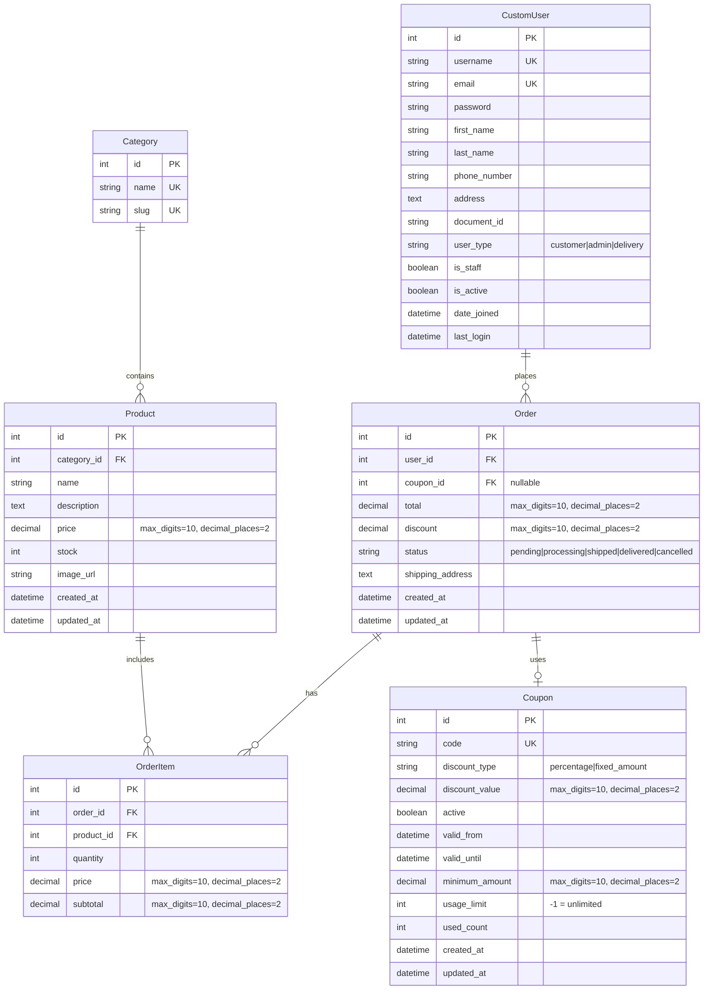

# 📊 Diagrama de Base de Datos - Ecommerce

## Estructura de la Base de Datos PostgreSQL

Este diagrama muestra la estructura completa de la base de datos del sistema de ecommerce, incluyendo todas las tablas, campos, tipos de datos y relaciones.

## 📋 Descripción de Tablas

### 👤 CustomUser (accounts_customuser)
Tabla de usuarios del sistema que extiende el modelo AbstractUser de Django.

**Campos principales:**
- `username`, `email`: Identificación única del usuario
- `user_type`: Define el rol (customer, admin, delivery)
- `is_staff`: Determina acceso al panel de administración
- `phone_number`, `address`, `document_id`: Datos de contacto y documento

### 🏷️ Category (store_category)
Categorías de productos con URLs amigables.

**Características:**
- `slug`: Generado automáticamente desde el nombre (ej. "ropa-moda")
- Índice único en nombre y slug

### 📦 Product (store_product)
Productos disponibles en la tienda.

**Campos clave:**
- `category_id`: Relación ForeignKey con Category
- `price`: Precio con 2 decimales
- `stock`: Inventario disponible
- `image_url`: URL de la imagen del producto
- `created_at`, `updated_at`: Timestamps automáticos

### 🎟️ Coupon (store_coupon)
Cupones de descuento con validaciones y límites.

**Tipos de descuento:**
- `percentage`: Descuento porcentual (ej. 10%)
- `fixed_amount`: Monto fijo (ej. S/.50)

**Validaciones:**
- `valid_from`, `valid_until`: Rango de fechas
- `minimum_amount`: Compra mínima requerida
- `usage_limit`: Límite de usos totales (-1 = ilimitado)
- `used_count`: Contador de usos

### 🛒 Order (store_order) - *Pendiente de implementación*
Órdenes de compra realizadas por usuarios.

**Campos proyectados:**
- `user_id`: Usuario que realiza la compra
- `coupon_id`: Cupón aplicado (opcional)
- `total`, `discount`: Montos calculados
- `status`: Estado del pedido
- `shipping_address`: Dirección de envío

### 📝 OrderItem (store_orderitem) - *Pendiente de implementación*
Líneas de detalle de cada orden.

**Campos proyectados:**
- `order_id`: Orden a la que pertenece
- `product_id`: Producto comprado
- `quantity`: Cantidad
- `price`: Precio unitario al momento de la compra
- `subtotal`: quantity × price

## 🔗 Relaciones

1. **Category → Product** (One-to-Many)
   - Una categoría contiene múltiples productos
   - `related_name='products'`

2. **CustomUser → Order** (One-to-Many)
   - Un usuario puede tener múltiples órdenes
   - Eliminación: Dependiente de política de negocio

3. **Order → OrderItem** (One-to-Many)
   - Una orden contiene múltiples items
   - Cascade delete

4. **Product → OrderItem** (One-to-Many)
   - Un producto puede estar en múltiples items de órdenes
   - Protección contra eliminación si tiene órdenes

5. **Coupon → Order** (One-to-Many, opcional)
   - Un cupón puede ser usado en múltiples órdenes
   - Una orden puede usar 0 o 1 cupón

## 🔐 Índices y Constraints

- **Unique Constraints:**
  - `CustomUser.username`
  - `CustomUser.email`
  - `Category.name`
  - `Category.slug`
  - `Product.name` + `Product.category` (implícito)
  - `Coupon.code`

- **Foreign Keys:**
  - `Product.category_id` → `Category.id` (CASCADE)
  - `Order.user_id` → `CustomUser.id`
  - `Order.coupon_id` → `Coupon.id` (SET_NULL)
  - `OrderItem.order_id` → `Order.id` (CASCADE)
  - `OrderItem.product_id` → `Product.id` (PROTECT)

## 📊 Estadísticas Actuales

- **Categorías:** 8 (Electrónica, Ropa y Moda, Hogar y Jardín, etc.)
- **Productos:** ~96 productos en producción
- **Usuarios registrados:** Variable
- **Cupones activos:** 4 (WELCOME10, MEGA25, SAVE50, FREESHIP)

## 🛠️ Tecnologías

- **DBMS:** PostgreSQL 16
- **ORM:** Django ORM 5.2
- **Hosting:** Render (PostgreSQL managed instance)
- **Migraciones:** Django Migrations

## 📝 Notas Técnicas

1. **Cascade Deletes:** Los productos se eliminan si se elimina su categoría
2. **Soft Deletes:** No implementado (considerar para órdenes históricas)
3. **Auditoría:** Timestamps `created_at` y `updated_at` en todas las tablas principales
4. **Validaciones:** Manejadas principalmente en el nivel de aplicación (serializers)
